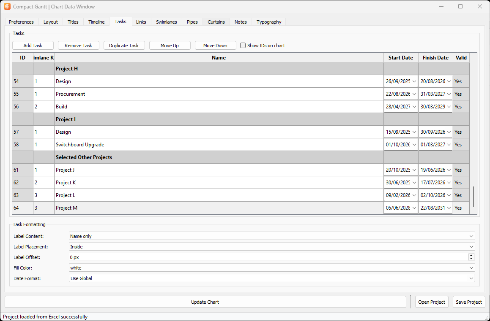
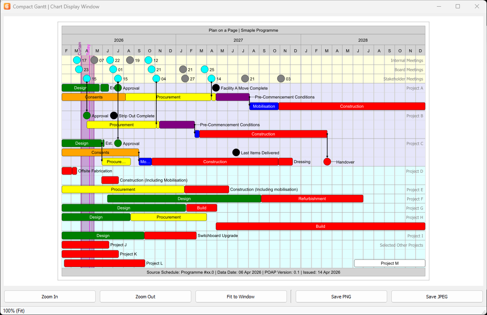
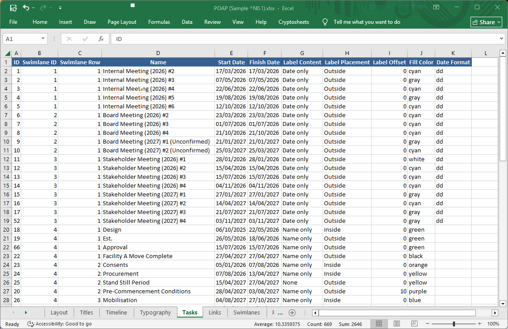

# Compact Gantt


A PyQt5-based tool for creating compact Gantt charts with SVG output, Excel import/export, transparent PNG export, and comprehensive customization options.

> **This project is no longer maintained.** The repository is archived and read-only. v1.6.1 is the final release. The source remains available under the GPL v3 — you are welcome to fork it and carry it forward.

## Download

**[Download CompactGantt.exe (v1.6.1)](https://github.com/haymanjoyce/compactgantt/releases/latest)** — Windows, 64-bit. No installer or Python required; download and run.

The executable is not code-signed, so Windows SmartScreen will show an "unrecognized app" prompt — choose *More info* → *Run anyway*. Some antivirus products also flag PyInstaller-built executables; this is a known false positive affecting the packaging tool rather than this application. If you would rather not trust the binary, build it yourself with `build.bat`.

## Screenshots

**Chart data window** — tabbed data entry for tasks, swimlanes, links, and styling:



**Chart display window** — live SVG preview with SVG and raster export:



**Project file** — projects are saved as ordinary Excel workbooks, so data can be edited outside the app:



## Features

- **Chart Configuration**
  - Customizable chart dimensions, margins, and gridlines
  - Configurable header and footer with custom text
  - Multiple time scales (years, months, weeks, days) with independent visibility and gridline controls
  - Horizontal and vertical gridline customization
  - Flexible date format preferences (separate formats for data entry and chart display)

- **Task Management**
  - Add, remove, duplicate, and reorder tasks
  - Task properties: ID, Swimlane Row, Name, Start Date, Finish Date, Lane (swimlane assignment)
  - Task formatting: Label visibility (Show/Hide) and placement (Inside/Outside)
  - Six bar fill patterns (solid, hatch, cross-hatch, horizontal, vertical, dots) with a configurable pattern colour over the fill colour
  - Numeric sorting for ID, Row columns
  - Chronological sorting for Start Date and Finish Date columns
  - Default sort by Swimlane and Row

- **Swimlanes**
  - Organize tasks into swimlanes with custom names
  - Visual swimlane dividers in task table
  - Automatic task assignment to swimlanes

- **Links**
  - Create task dependency links (from/to relationships)
  - Visual link validation

- **Pipes and Curtains**
  - Add pipe elements with dates and labels
  - Add curtain elements with start/end dates
  - Customizable formatting and positioning

- **Notes**
  - Add text annotations to the chart
  - Customizable positioning and formatting

- **Data Management**
  - Save and load project data as Excel (XLSX)
  - Data validation with error highlighting
  - Single-instance application (prevents multiple instances)

- **Export Options**
  - **Save SVG** writes the SVG source directly, for scalable vector output
  - **Save Image** writes PNG with a transparent background (ideal for overlays) or JPEG with a white opaque background, selected via the file dialog filter
  - Export confirmation dialogs

- **User Interface**
  - Tab-based interface for organized configuration
  - Customizable window positioning and screen preferences
  - Real-time chart preview, rendered by an embedded browser view with native zoom and panning
  - Keyboard shortcuts for common operations

## Quick Start

```bash
# Install dependencies
pip install -r requirements.txt

# Run the application
python main.py
```

## Requirements

- Python 3.8+
- PyQt5
- PyQtWebEngine (for the chart preview window; a separate package from PyQt5, and must match its Qt5 minor version)
- svgwrite
- openpyxl (for Excel import/export)
- python-dateutil (for date handling)

## Usage

1. **Launch the application** - Two windows will open: the data entry window and the SVG display window
   - The application uses single-instance detection to prevent multiple instances
2. **Configure chart settings** in the various tabs (see Tabs Overview below)
3. **Add tasks** in the Tasks tab:
   - Click "Add Task" to create a new task
   - Fill in task details (Name, Start Date, Finish Date, Row, Lane, etc.)
   - Configure label visibility and placement in the Task Formatting section
   - Use "Duplicate Task" to copy selected tasks with new IDs
   - Use "Move Up" and "Move Down" to reorder tasks
4. **Click "Update Chart"** to generate the SVG chart
5. **Export your chart**:
   - In the chart display window, click **Save SVG** for vector output, or **Save Image** for PNG (transparent background) or JPEG (white background) — the format follows the filter you pick in the save dialog
   - Use the File menu in the data entry window to save or open a project as Excel

## Tabs Overview

Tabs are organized in a content-first logical grouping:

- **Swimlanes**: Configure swimlanes with custom names and ordering
- **Tasks**: Task management, formatting, and properties
- **Links**: Create and manage task dependency links
- **Pipes**: Add and configure pipe elements with dates and labels
- **Curtains**: Add and configure curtain elements with start/end dates
- **Notes**: Add text annotations to the chart
- **Layout**: Chart dimensions, margins, and row configuration
- **Timeline**: Timeframe settings, scale visibility, and vertical gridlines
- **Titles**: Header and footer text and height settings
- **Typography**: Font family, sizes, and vertical alignment
- **Style**: User-editable colour fields for chart elements
- **Preferences**: Window positioning, screen preferences, and date format settings

## Keyboard Shortcuts

### Data Entry Window
- **Ctrl+S**: Save project (Excel)
- **Ctrl+O**: Open project (Excel)
- **Ctrl+N**: Add new task (in Tasks tab)
- **Delete**: Remove selected task(s) (in Tasks tab)

The chart display window has no keyboard shortcuts; zoom and panning are handled natively by the embedded browser view.

## Development

```bash
# Install dependencies
pip install -r requirements.txt

# Run smoke tests (no PyQt5 required)
python tests/test_smoke.py

# Run integration tests
python tests/test_project_save_load.py
```

## Project Structure

- `ui/` - User interface components
  - `tabs/` - Tab widgets (Layout, Tasks, Titles, etc.)
  - `table_utils.py` - Table utility functions
  - `main_window.py` - Main application window
  - `svg_display.py` - SVG preview window
- `services/` - Business logic
  - `gantt_chart_service.py` - SVG chart generation
- `models/` - Data structures (all dataclasses)
  - `project.py` - Project data model
  - `task.py` - Task model
  - `link.py` - Dependency link model
  - `swimlane.py` - Swimlane model
  - `pipe.py` - Pipe marker model
  - `curtain.py` - Curtain model
  - `note.py` - Note annotation model
  - `frame.py` - Frame configuration
- `repositories/` - File I/O
  - `excel_repository.py` - Excel import/export
- `config/` - Configuration
  - `app_config.py` - Application configuration
- `validators/` - Data validation
- `utils/` - Utility functions
- `tests/` - Test files

## Architecture

### Data Structures
**Preference: Use dataclasses with named fields instead of positional arrays.**

- ✅ **DO**: Use dataclasses (e.g., `Task`, `Link`) with named fields
- ❌ **DON'T**: Use positional lists/arrays where field access relies on index positions

**Rationale**: Positional arrays are brittle—adding, removing, or reordering fields breaks existing code. Named fields (dataclasses) provide:
- Type safety and IDE autocomplete
- Clear field names instead of magic indices
- Resilience to field changes
- Self-documenting code

**Current Implementation**:
- All models are fully refactored dataclasses: `Task`, `Link`, `Swimlane`, `Pipe`, `Curtain`, `Note`

**Guidelines for New Code**:
- When creating new data entities, use `@dataclass` with named fields
- UI boundary code should work directly with dataclass objects, not positional lists

## Licenses

This application is licensed under the GNU General Public License v3. [LICENSE](LICENSE) holds the verbatim GPL v3 text; [NOTICE](NOTICE) holds the project's own copyright and attribution statement.

It uses [PyQt5](https://www.riverbankcomputing.com/software/pyqt/), which is also licensed under the GPL v3 by Riverbank Computing Limited.

## Copyright

Copyright (C) 2014-2025 Richard Hayman-Joyce.
